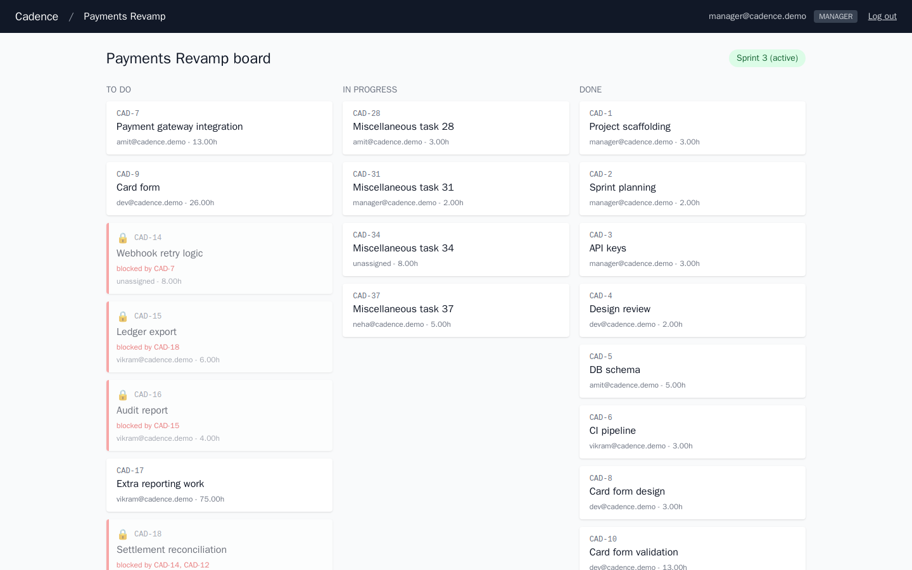
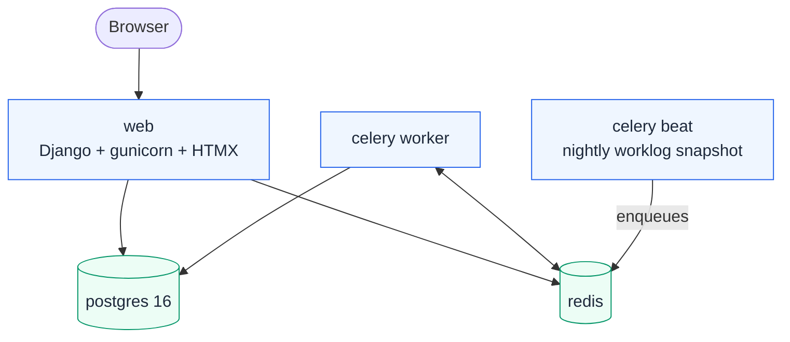
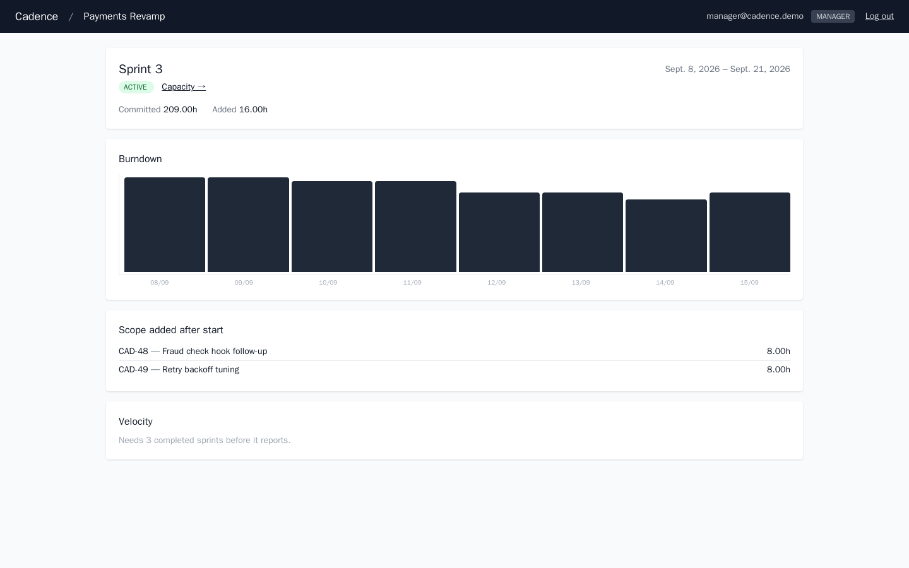
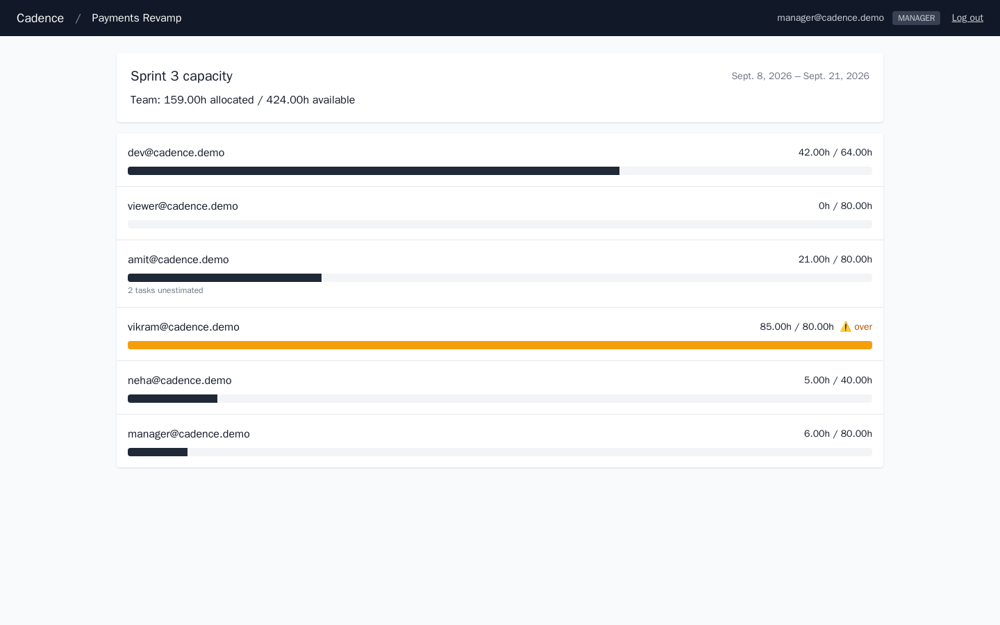

<div align="center">

# Cadence

**Sprint planning and capacity tool for small teams — the two questions a kanban board never answers: can this task start, and does anyone have room for it.**

[](https://github.com/Nitishjha7/cadence/actions/workflows/ci.yml)
[](tests/)
[](LICENSE)
[](cadence/settings.py)
[](projects/models.py)
[](sprints/tasks.py)
[](templates/)

</div>

<p align="center">
  
</p>

<p align="center">
  <a href="#quick-start">Quick start</a> ·
  <a href="#how-it-works">How it works</a> ·
  <a href="#the-five-screens">Screens</a> ·
  <a href="docs/">Engineering notes</a>
</p>

---

## What this is not

It's not a Jira clone, and it's not a kanban board with drag-and-drop.

A board where you create a task, change its status and move a card is CRUD
with a nice front end. Cadence is built around the two questions a board
doesn't answer:

**1. Can this task even be started?** Task B needs Task A finished first. A
needs the API keys. If someone accidentally makes the API keys task depend
on B, three tasks now wait on each other forever — and a board will
happily let you do it and show you nothing.

**2. Does the person it's assigned to have room?** Everyone has forty
hours in a sprint. Two of them are on leave. One already has fifty-two
hours of work. A board shows you cards; it doesn't show you that the
sprint is over capacity before the sprint starts.

Those two questions — a graph problem and an arithmetic problem — are the
project.

---

## Overview

| | |
|---|---|
| **Backend** | Django 5, Python 3.12 |
| **Data** | PostgreSQL 16 |
| **Frontend** | Django templates + HTMX (server-rendered, no SPA) |
| **Async** | Celery 5.4 + Beat, Redis |
| **Admin** | Django admin as the manager console |
| **Infra** | Docker Compose (5 containers), GitHub Actions CI |
| **Tests** | 65, against a real Postgres database |

---

## How it works



**Cycle detection runs before the write, not after.** Before saving a
dependency `task -> depends_on`, a depth-first search walks forward from
the target to see whether it can already reach the task being edited. If
it can, the new edge would close a loop:

```
Circular dependency:
  CAD-3 (API keys) -> CAD-7 (Payment gateway) -> CAD-3 (API keys)
Neither task could ever start.
```

The hard part isn't detecting that. It's still allowing a **diamond** — `A
-> B`, `A -> C`, `B -> D`, `C -> D` — which looks like a cycle to a naive
check (D is reached twice) and is perfectly legal.

**Blocked status is derived, never stored.** No user ever sets a task to
"blocked". A task is blocked if any dependency is unfinished, and the
moment the last one completes it becomes available on its own, with **no
write to that task's row at all**. A stored flag would need updating
whenever any dependency changed state, and the first missed update gives
you a tool that says "ready" about something that isn't.

**Sprint scope is frozen at start.** When a sprint starts, every
committed task's estimate is snapshotted, along with every member's
capacity. Work added afterwards is scope creep — a task with no snapshot
row — rendered as a separate series on the burndown, so a team that takes
on extra work mid-sprint doesn't look identical to one that planned
correctly.

<p align="center">
  
</p>

<p align="center"><sub>The burndown above is drawn entirely from daily <code>WorkLog</code> snapshots — the step on the last day is two tasks added after the sprint started, rendered as its own series rather than folded into the line.</sub></p>

A few other decisions worth knowing about:

- **404, not 403, for a non-member.** A user who isn't on a project gets a
  404 on any of its URLs — a 403 would itself confirm the project exists.
- **Over-allocation warns, it never blocks.** Managers legitimately
  overload people on purpose; a tool that refuses gets worked around
  within a day and then knows nothing.
- **Unestimated tasks count as zero capacity**, and the UI says so
  separately (`2 tasks unestimated`) rather than hiding it or inventing a
  number.

More detail, including the parts that were easy to get subtly wrong (the
diamond, the query-count regressions), is in
[docs/architecture.md](docs/architecture.md).

---

## Quick start

Only Docker Desktop is required.

```bash
git clone https://github.com/Nitishjha7/cadence.git
cd cadence

cp .env.example .env
docker compose up -d --build
docker compose exec web python manage.py migrate
docker compose exec web python manage.py seed_demo
```

| Service | URL |
|---|---|
| App | http://localhost:8005 |
| Admin | http://localhost:8005/admin/ |

**Demo logins:**

| Role | Login | Sees |
|---|---|---|
| Manager | `manager@cadence.demo` / `password` | Everything, can start sprints, reaches `/admin/` |
| Contributor | `dev@cadence.demo` / `password` | Can edit tasks, cannot start sprints |
| Viewer | `viewer@cadence.demo` / `password` | Read only |

Log in as the manager, open the board, click into task **CAD-3** (API
keys), add a dependency on **CAD-7** (Payment gateway) — it rejects with
the exact cycle path shown above, live, no shell required.

---

## The five screens

| Screen | Route | What it exists to show |
|---|---|---|
| Board | `/projects/{id}/board/` | Blocked tasks, greyed, with what blocks them named |
| Task detail | `/tasks/{id}/` | Dependencies in both directions |
| Add dependency | inline on task detail (HTMX) | The cycle-rejection box |
| Capacity | `/sprints/{id}/capacity/` | Load bars, leave, over-allocation |
| Sprint + burndown | `/sprints/{id}/` | Scope creep, as a separate visible series |

Django templates + Tailwind, HTMX for the two places that need a partial
update (the dependency form, the state selector). No drag-and-drop, no
animation — the point is what's behind the screen, not the CSS.

<p align="center">
  
</p>

---

## Testing

```bash
docker compose exec web pytest                          # 65 tests, ~40s
docker compose exec web pytest tests/test_dependency_graph.py -v
```

Runs against a real Postgres, not SQLite — the `TaskDependency`
constraints and the query-count assertions both depend on it. Same suite
runs in [CI](.github/workflows/ci.yml) on every push. See
[docs/testing.md](docs/testing.md) for what's covered and why.

---

## Project structure

```
projects/     Project, Member, permissions, project-list view, seed_demo
tasks/        Task, TaskDependency, cycle detection, board/detail views
sprints/      Sprint, capacity, snapshot/burndown, celery task
templates/    Django templates + HTMX partials
tests/        pytest, 65 tests, factory_boy factories
docs/         Architecture, setup, testing
```

---

## Engineering notes

| | |
|---|---|
| [Architecture](docs/architecture.md) | Schema, cycle detection, capacity, sprint snapshot, permissions |
| [Testing](docs/testing.md) | What's covered and why it needs a real Postgres |
| [Setup](docs/setup.md) | Running it locally, demo logins, configuration |

---

## Not built

- **Drag-and-drop board** — looks impressive, teaches nothing, and costs
  days of front-end work the dependency graph deserves instead.
- **Real-time collaborative updates** — a different problem (WebSockets,
  conflict resolution) already covered elsewhere in my portfolio.
- **Comments, attachments, custom fields, workflows** — breadth, not the
  depth this project is about.
- **Time tracking** — estimates are enough for capacity; actuals are a
  separate product.
- **Holiday calendar in capacity** — it assumes uniform working days.
- **Not deployed** — the Compose stack is production-shaped; nothing is
  hosted yet.

---

## Tech stack

Python 3.12 · Django 5 · PostgreSQL 16 · Celery 5.4 + Beat · Redis ·
django-htmx · Tailwind (CDN) · gunicorn · whitenoise · Docker Compose ·
GitHub Actions

## License

[MIT](LICENSE)
